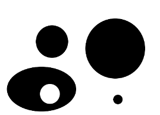
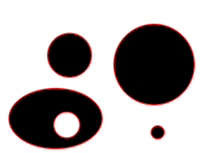
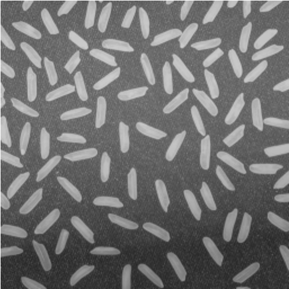
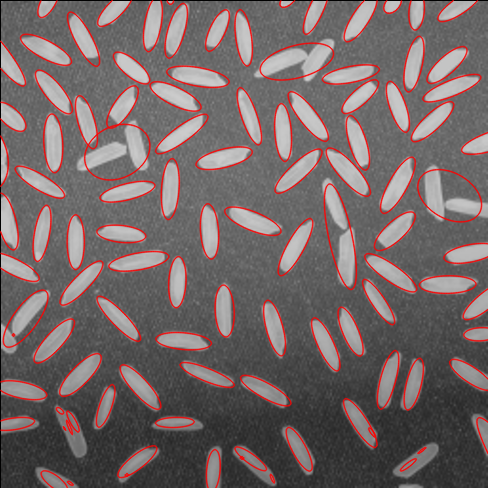

<div class="cover" style="page-break-after:always;font-family:方正公文仿宋;width:100%;height:100%;border:none;margin: 0 auto;text-align:center;">
    <div style="width:50%;margin: 0 auto;height:0;padding-bottom:10%;">
        
    </div>
    </br></br></br></br>
    <div style="width:50%;margin: 0 auto;height:0;padding-bottom:40%;">
        
   </div>
    </br></br></br></br></br>
<p style="text-align:center;font-size:14pt;margin: 0 auto">浙江大学实验报告</p>
	</br>
	</br>
	<table style="border:none;text-align:center;width:72%;font-family:仿宋;font-size:14px; margin: 0 auto;">
	<tbody style="font-family:方正公文仿宋;font-size:12pt;">
	  <tr style="font-weight:normal;"> 
	        <td style="width:20%;text-align:right;">课　　程</td>
	       <td style="width:2%">：</td> 
	        <td style="width:40%;font-weight:normal;border-bottom: 1px solid;text-align:center;font-family:仿宋">计算机视觉 </td>     </tr>
    <tr style="font-weight:normal;"> 
	        <td style="width:20%;text-align:right;">实验名称</td>
	       <td style="width:2%">：</td> 
	        <td style="width:40%;font-weight:normal;border-bottom: 1px solid;text-align:center;font-family:仿宋">实现椭圆拟合</td>     </tr>
	    <tr style="font-weight:normal;"> 
	        <td style="width:20%;text-align:right;">姓　　名</td>
	       <td style="width:2%">：</td> 
	        <td style="width:40%;font-weight:normal;border-bottom: 1px solid;text-align:center;font-family:仿宋"> 吕皓明</td>     </tr>
	        <td style="width:20%;text-align:right;">专　　业</td>
	       <td style="width:2%">：</td> 
	        <td style="width:40%;font-weight:normal;border-bottom: 1px solid;text-align:center;font-family:仿宋"> 计算机科学与技术</td>     </tr>
	    <tr style="font-weight:normal;"> 
	        <td style="width:20%;text-align:right;">学　　号</td>
	       <td style="width:2%">：</td> 
	        <td style="width:40%;font-weight:normal;border-bottom: 1px solid;text-align:center;font-family:仿宋">3190103303 </td>     </tr>
	    <tr style="font-weight:normal;"> 
	        <td style="width:20%;text-align:right;">指导老师</td>
	       <td style="width:2%">：</td> 
	        <td style="width:40%;font-weight:normal;border-bottom: 1px solid;text-align:center;font-family:仿宋">宋明黎</td>     </tr>
	        <td style="width:20%;text-align:right;">日　　期</td>
	       <td style="width:2%">：</td> 
	        <td style="width:40%;font-weight:normal;border-bottom: 1px solid;text-align:center;font-family:仿宋">2021/11/30</td>     </tr>
	</tbody>              
	</table>
</div>

## 实验目的和要求

调用CvBox2D cvFitEllipse2(const CvArr* points)实现椭圆拟合

## 实验内容和原理

CvBox2D(opencv 2.x以上版本使用RotatedRect)

* OpenCV提供的椭圆拟合API:
  ```c++
  RotatedRect fitEllipse(InputArray points)
  ```
  输入是二维点集，要求拟合的点至少6个。可使用`std::vector<>` or `Mat`进行存储。

* 绘制椭圆API:
  ```c++
  void ellipse(Mat &img, const RotatedRect &box, const Scalar &color, int thickness = 1, int lineType = 8)
  ```

## 实验步骤和分析

1. 读入图像
   ```c++
   Mat img = imread(filePath);
   ```

2. 得到灰度图
   ```c++
   Mat grayImg;
   cvtColor(img, grayImg, COLOR_BGR2GRAY);
   ```

3. 二值化
   ```c++
   Mat binaryImg;
   threshold(grayImg, binaryImg, 128, 255, THRESH_BINARY);
   ```

4. 查找轮廓
   ```c++
   vector<vector<Point>> contours;
   findContours(binaryImg, contours, RETR_LIST, CHAIN_APPROX_SIMPLE);
   ```

5. 进行拟合
    ```c++
    for (auto &it : contours) {
        if (it.size() < 6) continue;
        Mat points;
        Mat(it).convertTo(points, CV_32F);
        RotatedRect box = fitEllipse(points);
        ellipse(img, box, Scalar(0, 0, 255), 1, LINE_AA);
    }
    ```

6. 输出图像
   ```c++
   imwrite(imgName, img);
   ```

## 实验环境及运行方法

*   实验环境：Mac OS

*   运行方法

    ```bash
    ./hw2 "路径名"
    ```

## 实验结果展示

1. 图片1

    
    

2. 图片2
   
   
   

## 心得体会

本次实验的难度还是比较平常的，基本上还是进行OpenCV的API的调用，但是在过程中还是有一些需要注意的细节。比如在进行`findContours`的调用的时候，有一个参数设置的是`CHAIN_APPROX_SIMPLE`，但是其实这是尝试了几遍后的结果。一开始设置了`CHAIN_APPROX_NONE`的时候，就会在图像的整个外圈描绘出一个椭圆，这就是参数选择的问题了，我们只需要图中那些小的椭圆的形状。所以说在熟悉OpenCV的过程中，有些参数的设置还是看文档不能完全学会的，还是需要自己进行一定的尝试。