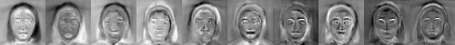
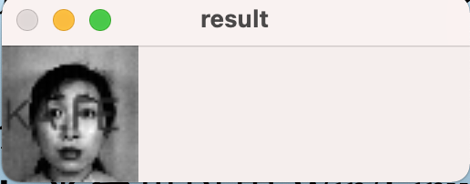
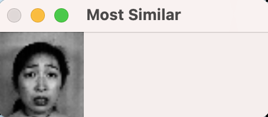

<div class="cover" style="page-break-after:always;font-family:方正公文仿宋;width:100%;height:100%;border:none;margin: 0 auto;text-align:center;">
    <div style="width:50%;margin: 0 auto;height:0;padding-bottom:10%;">
        
    </div>
    </br></br></br></br>
    <div style="width:50%;margin: 0 auto;height:0;padding-bottom:40%;">
        
   </div>
    </br></br></br></br></br>
<p style="text-align:center;font-size:14pt;margin: 0 auto">浙江大学实验报告</p>
	</br>
	</br>
	<table style="border:none;text-align:center;width:72%;font-family:仿宋;font-size:14px; margin: 0 auto;">
	<tbody style="font-family:方正公文仿宋;font-size:12pt;">
	  <tr style="font-weight:normal;"> 
	        <td style="width:20%;text-align:right;">课　　程</td>
	       <td style="width:2%">：</td> 
	        <td style="width:40%;font-weight:normal;border-bottom: 1px solid;text-align:center;font-family:仿宋">计算机视觉 </td>     </tr>
    <tr style="font-weight:normal;"> 
	        <td style="width:20%;text-align:right;">实验名称</td>
	       <td style="width:2%">：</td> 
	        <td style="width:40%;font-weight:normal;border-bottom: 1px solid;text-align:center;font-family:仿宋">Eigenface 人脸识别算法</td>     </tr>
	    <tr style="font-weight:normal;"> 
	        <td style="width:20%;text-align:right;">姓　　名</td>
	       <td style="width:2%">：</td> 
	        <td style="width:40%;font-weight:normal;border-bottom: 1px solid;text-align:center;font-family:仿宋"> 吕皓明</td>     </tr>
	        <td style="width:20%;text-align:right;">专　　业</td>
	       <td style="width:2%">：</td> 
	        <td style="width:40%;font-weight:normal;border-bottom: 1px solid;text-align:center;font-family:仿宋"> 计算机科学与技术</td>     </tr>
	    <tr style="font-weight:normal;"> 
	        <td style="width:20%;text-align:right;">学　　号</td>
	       <td style="width:2%">：</td> 
	        <td style="width:40%;font-weight:normal;border-bottom: 1px solid;text-align:center;font-family:仿宋">3190103303 </td>     </tr>
	    <tr style="font-weight:normal;"> 
	        <td style="width:20%;text-align:right;">指导老师</td>
	       <td style="width:2%">：</td> 
	        <td style="width:40%;font-weight:normal;border-bottom: 1px solid;text-align:center;font-family:仿宋">宋明黎</td>     </tr>
	        <td style="width:20%;text-align:right;">日　　期</td>
	       <td style="width:2%">：</td> 
	        <td style="width:40%;font-weight:normal;border-bottom: 1px solid;text-align:center;font-family:仿宋">2021/12/9</td>     </tr>
	</tbody>              
	</table>
</div>

## 实验目的和要求

自己写代码实现Eigenface人脸识别的训练与识别过程： 
1. 假设每张人脸图像只有一张人脸，且两只眼睛位置已知（即可人工标注给出）。每张图像的眼睛位置存在相应目录下的一个与图像文件名相同但后缀名为txt的文本文件里，文本文件中用一行、以空格分隔的4个数字表示，分别对应于两只眼睛中心在图像中的位置；
2. 实现两个程序过程（两个执行文件），分别对应训练与识别。
3. 自己构建一个人脸库（至少40人，包括自己），课程主页提供一个人脸库可选用。
4. 不能直接调用OpenCV里面与Eigenface相关的一些函数，特征值与特征向量求解函数可以调用;  只能用C/C++，Python，不能用其他编程语言；GUI只能用OpenCV自带的HighGUI，不能用QT或其他的；平台可以用Win/Linux/MacOS，建议Win优先；
5. “训练程序格式大致为： “mytrain.exe  能量百分比  model文件名...”其他参数 ，用能量百分比  决定取多少个特征脸，将训练结果输出保存到model文件中。同时将前10个特征脸拼成一张图像，然后显示出来。
6. “识别程序格式大致为： “mytest.exe  人脸图像文件名model文件名...”其他参数 ，将model文件装载进来后，对输入的人脸图像进行识别，并将识别结果叠加在输入的人脸图像上显示出来，同时显示人脸库中跟该人脸图像最相似的图像。

## 实验内容和原理

1. 获得人脸图像的训练集，通常为整个人脸数据库；
2. 对所有人脸图像作归一化处理；
3. 通过PCA计算获得一组特征向量(特征脸)。通常一百个特征向量就足够；
4. 将每幅人脸图像都投影到由该组特征脸张成的子空间中，得到在该子空间坐标；
5. 对输入的一幅待测图像，归一化后，将其映射到特征脸子空间中。然后用某种距离度量来描述两幅人脸图像的相似性，如欧氏距离。

## 实验步骤和分析

### train

#### 构建人脸库

将老师在群里提供的文件下载下来，先进行一定的观察，观察后发现前缀名一样的是同一个人。

此外，老师提供的文件夹中并没有.txt文件，即包含人眼睛位置的信息。

然而意识到眼睛位置是为了将人脸图片进行摆正，而提供的人脸库的图片基本都是正的，因此就不需要额外地进行人工标注位置了。

然后进行训练和测试集的拆分，将每个人的最后一张人脸图像用于测试，其余的全部都拿来训练。

#### 一些基本的参数设置

```c++
const Size standardSize = Size(50, 50);
string filePath = "../JAFFE/train";
double energyPercent = atof(argv[1]);
string modelName = argv[2];
vector<string> imgPaths;
glob(filePath + "/*.tiff", imgPaths);
```

#### 读入训练图片

遍历训练集进行读入操作，然后将图片转换成我们想要的大小，并进行归一化处理。

```c++
for (auto &each: imgPaths) {
    Mat img = imread(each, IMREAD_GRAYSCALE);
    resize(img, img, standardSize);
    normalize(img, img, 255, 0, NORM_MINMAX);
    dataset.push_back(img);
}
```

#### 计算协方差矩阵以及均值矩阵

调用OpenCV提供的`calcCovarMatrix`函数，可以直接算出协方差和均值矩阵。

```c++
Mat mean, covar;
calcCovarMatrix(dataset, covar, mean, COVAR_NORMAL);
```

#### 求出特征脸

首先调用OpenCV提供的`eigen`函数，可以求得特征向量，然后根据能量百分比取出一定的特征向量，来进行映射空间的构建。

同时根据任务需求，我们将前10个特征脸保存下来并拼接成一张图片然后输出。

```c++
Mat eigenValues, eigenVectors;
eigen(covar, eigenValues, eigenVectors);
int eigenCount = eigenVectors.rows * energyPercent;
Mat AT = Mat(eigenCount, standardSize.height * standardSize.width, CV_64F);
Mat A = AT.t();
vector<Mat> topTens;
Mat topTen;
for (int i = 0; i < eigenCount; i++) {
    Mat tmp1 = Mat(standardSize.height, standardSize.width, CV_64F);
    Mat tmp2 = Mat(standardSize.height, standardSize.width, CV_8UC1);
    for (int j = 0; j < standardSize.height * standardSize.width; j++) {
        tmp1.at<double>(j / standardSize.width, j % standardSize.width) = eigenVectors.at<double>(i, j);
        AT.at<double>(i, j) = eigenVectors.at<double>(i, j);
        A.at<double>(j, i) = eigenVectors.at<double>(i, j);
    }
    normalize(tmp1, tmp1, 255, 0, NORM_MINMAX);
    tmp1.convertTo(tmp2, CV_8UC1);
    eigenFaces.push_back(tmp2);
    if (i < 10) {
        topTens.push_back(tmp2);
    }
}
hconcat(topTens, topTen);
imwrite("topTen.jpg", topTen);
```

#### 保存模型

```c++
FileStorage storage("../" + modelName, FileStorage::WRITE);
storage << "model" << A;
storage.release();
```

### test

#### 参数设置及模型加载

```c++
string fileName = argv[1];
string modelName = argv[2];

Mat eigenM;
FileStorage storage("../" + modelName, FileStorage::READ);
storage["model"] >> eigenM;
storage.release();
```

#### 读入测试图并求出映射空间中的坐标

```c++
Mat testImg = imread("../JAFFE/test/" + fileName, IMREAD_GRAYSCALE);
resize(testImg, testImg, standardSize);
normalize(testImg, testImg, 255, 0, NORM_MINMAX);
Mat testMat = testImg.reshape(0, 1);
testMat.convertTo(testMat, CV_64F);
Mat testVec = testMat * eigenM;
```

#### 查找最相似的图像

采用欧式距离来衡量两个图像之间的相似性，选择相似度最高（即距离最小）的作为结果。

```c++
vector<string> imgPaths;
glob("../JAFFE/train/*.tiff", imgPaths);
double minDis = -1;
Mat mostSim;
string mostSimName;
for (auto &each: imgPaths) {
    Mat img = imread(each, IMREAD_GRAYSCALE);
    resize(img, img, standardSize);
    img = img.reshape(1, 1);
    img.convertTo(img, CV_64F);
    Mat judVec = img * eigenM;
    Mat differ = testVec - judVec;
    double dis = norm(differ, NORM_L2);
    if (dis < minDis || minDis == -1) {
        minDis = dis;
        img.reshape(1, standardSize.height).convertTo(mostSim, CV_8UC1);
        mostSimName = each;
    }
}
```

#### 识别结果叠加至输入图像上

```c++
string info = mostSimName.substr(15, 5);
putText(
    testImg,
    info,
    Point(0, 30),
    FONT_HERSHEY_SIMPLEX,
    0.5,
    Scalar(40, 40, 50),
    1,
    LINE_AA
);
```

#### 输出结果

```c++
imshow("result", testImg);
imshow("Most Similar", mostSim);
```

## 实验环境及运行方法

*   实验环境：Mac OS

*   运行方法（举例）

    ```bash
    cd train
    make
    ./train 0.1 eigen
    cd ..
    cd test
    make
    ./test KA.FE4.48.tiff eigen
    ```
    


## 实验结果展示

1. 编译运行后可以看到train文件夹下生成了topTen.jpg
    

2. 随机选取一个图像进行识别
   ```bash
   ./test KA.FE4.48.tiff eigen
   ```
    结果显示为KA.FE
    
    最相似图像
    

## 心得体会

本次实验遇到的困难有两个。
第一个是我自己在上课的时候其实对于eigenface算法也就是听了个大概，没有完全地理解透彻，因此在进行实验的初期有一些吃力。最后选择了是去复习ppt上的内容并结合了一些网上的资料博客将这个算法完全的吃透。
第二个是OpenCV当中一些库函数的熟悉问题。在使用一些简单的搜索的时候其实并没有能够找到特别介绍OpenCV进行特征值求解的很方便的函数。但是因为课件上面提到了可以进行这些函数的调用，于是我就去官方的文档里面查找了一下，最后找到了在实验当中使用的函数。如果说是完全自己写的话还是非常麻烦的，但是OpenCV提供的库函数还是非常方便的。唯一的遗憾就是OpenCV+C++的中文资料还是不够多，查找英文资料感觉还是比较费时的。
